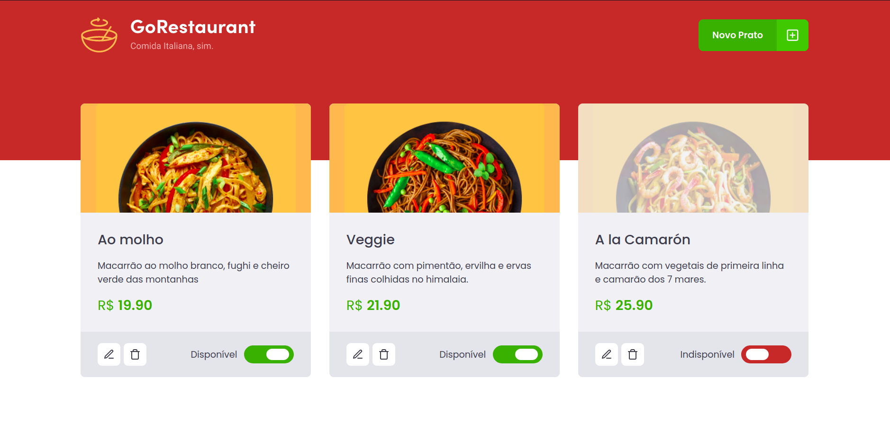

# Rocket Seat Ignite - GoRestaurant

<p align="center">
  
</p>

## Table of Contents

- [About](#about)
- [Getting Started](#getting_started)
- [Usage](#usage)
- [Docs](#docs)
- [Resources](#resources)

## About <a name = "about"></a>

A basic restaurant menu management UI with ReactJS and Typescript.

## Getting Started <a name = "getting_started"></a>

### Prerequisites

- `node >= 12.0.0`

### Installation

1. Clone this repo locally and install the required packages:

```bash
$ git clone https://github.com/librity/ignite_restaurant.git
$ cd ignite_restaurant
$ yarn install
```

2. Start a json server (mock backend):

```bash
$ yarn server
```

3. Start a dev server:

```bash
$ yarn start
```

4. Open http://localhost:3000 your web browser.

## Usage <a name = "usage"></a>

On the home screen, you can edit, delete and disable items.
You can create a new item by clicking in `Novo Prato`.

## Docs <a name = "docs"></a>

- https://github.com/typicode/json-server
- https://www.typescriptlang.org/download

## Resources <a name = "resources"></a>

- https://www.tutorialspoint.com/typescript/typescript_interfaces.htm
- https://stackoverflow.com/questions/61475289/property-value-does-not-exist-on-type-never-when-use-useref-hook-in-mui
- https://www.pluralsight.com/guides/defining-props-in-react-function-component-with-typescript
